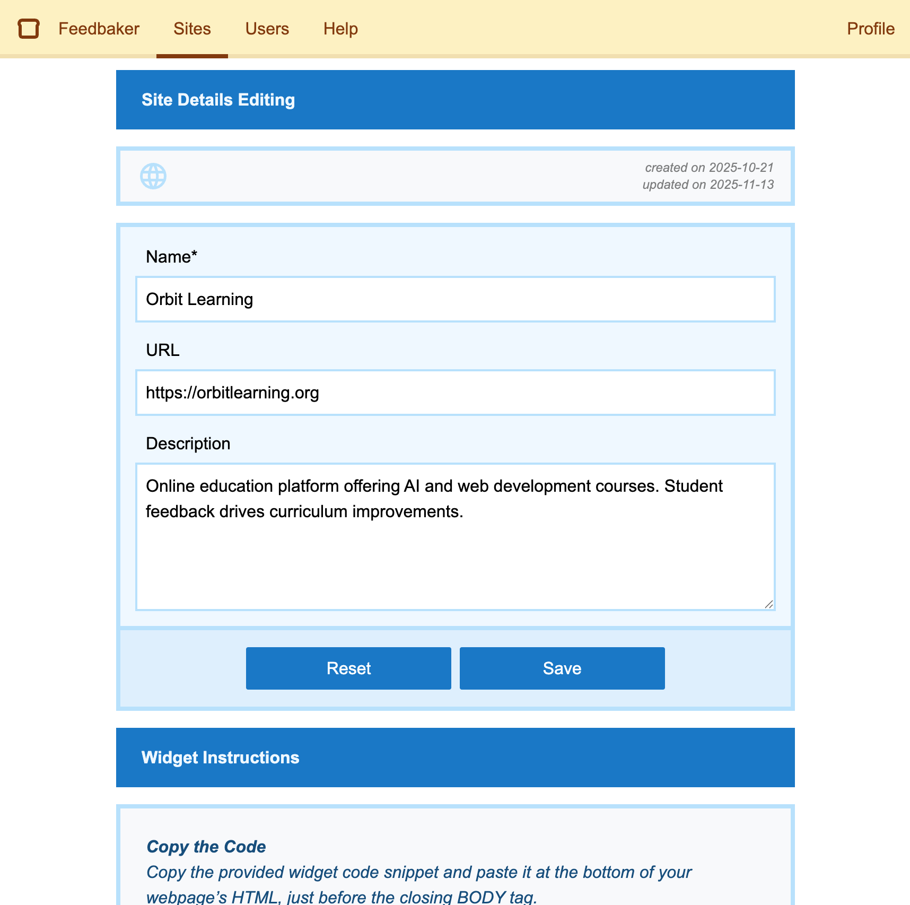
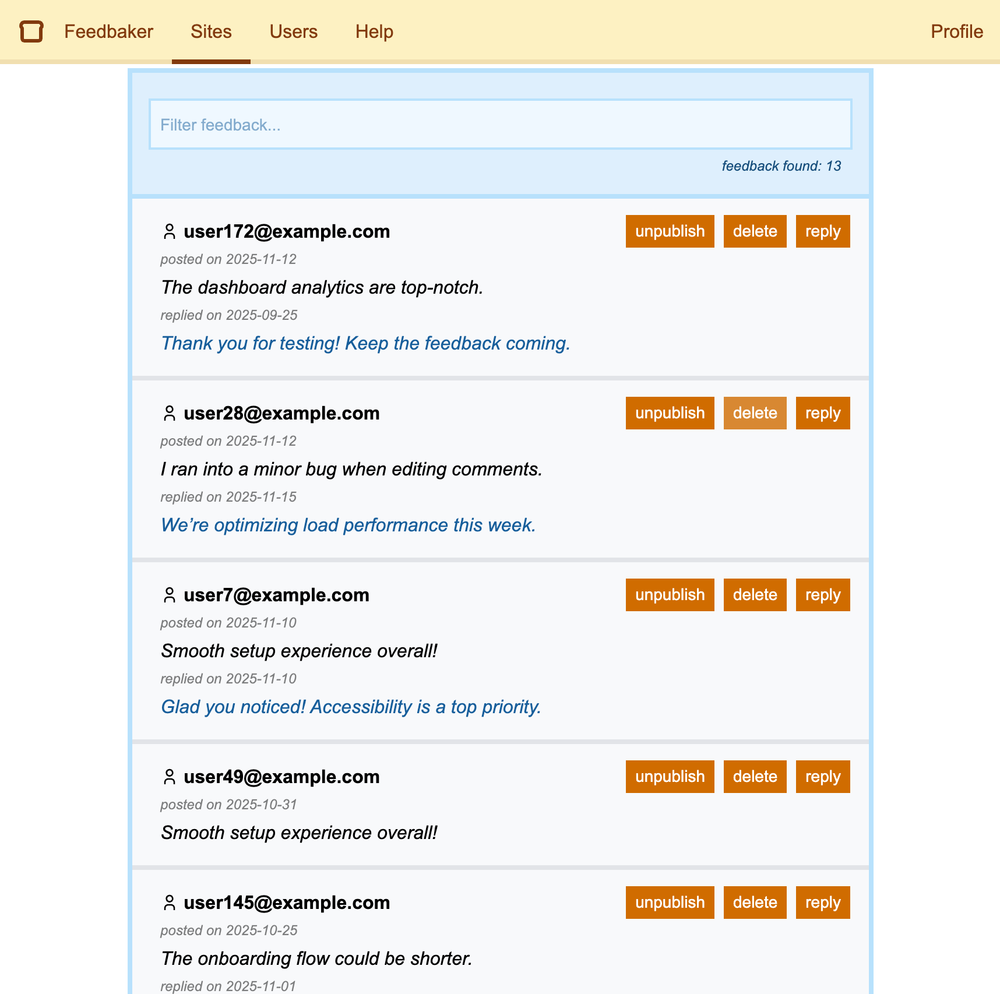
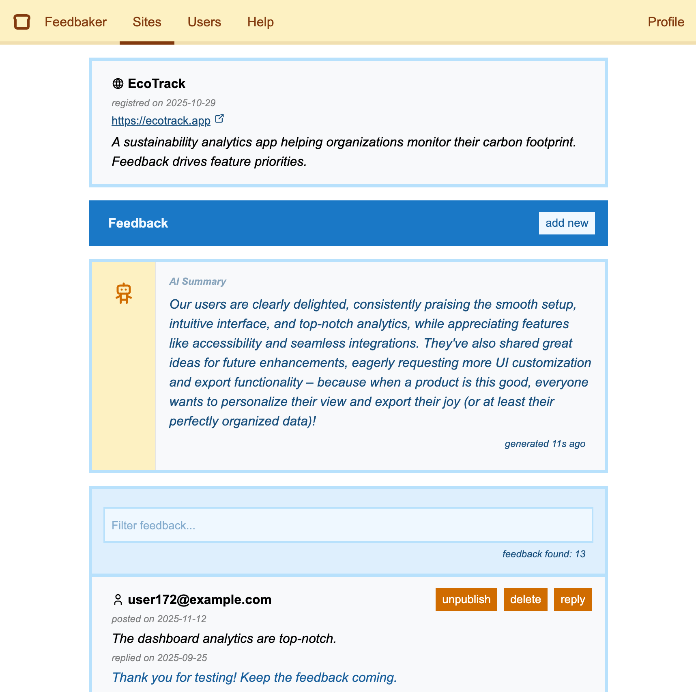
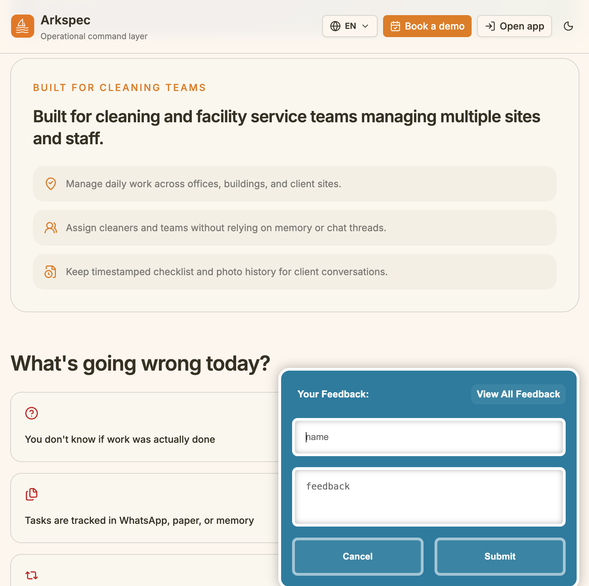

# Feedbaker

**A full-stack SaaS application for collecting, managing, and analyzing user feedback.**

Feedbaker provides an end-to-end feedback workflow: website owners register their sites, collect feedback from users, manage submissions through a dashboard, and generate AI-assisted summaries to surface recurring themes.

The project covers the full lifecycle of a modern web application: architecture, relational data modeling, backend APIs, frontend development, authentication and authorization, AI integration, automated testing, CI/CD, containerized development, and cloud deployment.

## Product Overview

Feedbaker helps websites and web applications collect feedback without building a custom feedback system from scratch.

Core workflows:

- **Visitors** submit feedback through a public form or embeddable widget.
- **Owners** manage sites and feedback and generate AI-assisted summaries.
- **Admins** manage users, sites, and feedback across the platform.

## Product Preview

### Site Management

Shows the owner workflow for creating and editing registered sites, including metadata, site URLs, descriptions, and widget setup instructions.



### Feedback Management

Shows the feedback moderation workflow, including filtering, owner replies, publishing controls, and delete actions.



### AI Summary

Shows Gemini-powered feedback summarization for a site, helping owners identify recurring themes across user submissions.



### Embeddable Widget

Shows the lightweight widget that can be added to external websites for collecting visitor feedback.



## My Role

Feedbaker is an independent end-to-end engineering project.

I designed and implemented the application architecture, PostgreSQL data model, REST API, authentication and authorization flows, frontend product experience, automated tests, CI/CD workflows, and deployment setup.

## Why I Built It

I built Feedbaker to take ownership of a product across the entire stack and explore the engineering decisions involved in taking a SaaS application from architecture through implementation and deployment.

The project includes:

- application and API architecture
- relational data modeling with PostgreSQL
- Google OAuth authentication and JWT session handling
- role-aware authorization for visitors, owners, and admins
- frontend product flows with Next.js and React
- embedded feedback collection for external sites
- AI-assisted feedback summarization with Gemini
- automated server tests and CI checks
- containerized local development
- separate frontend and backend deployment workflows

## Architecture

Feedbaker uses a separated frontend/backend architecture with a REST API boundary.

```text
+--------------------------+
|  Next.js / React client  |
|  TypeScript + Tailwind   |
+------------+-------------+
             |
             | REST API
             v
+--------------------------+
|  Express / Node.js API   |
|  TypeScript + Zod        |
+------------+-------------+
             |
             v
+--------------------------+
|       PostgreSQL         |
+--------------------------+
```

## Engineering Highlights

### End-to-end TypeScript

TypeScript is used across the frontend and backend, keeping the application logic, API integration, validation, and tests consistent across the stack.

### Authentication, authorization and security

Users authenticate through Google OAuth. The backend verifies Google credentials and issues JWT sessions through HTTP-only cookies.

Authenticated mutations use CSRF protection, while role-aware authorization separates visitor, owner, and administrator capabilities. The project also includes rate limiting and scheduled dependency auditing.

### Feedback collection

Feedback can be submitted through public routes and an embeddable widget, then managed centrally from the authenticated dashboard.

### AI-assisted analysis

Owners can generate Gemini-powered summaries for site feedback, turning individual submissions into higher-level product insights.

### Production-oriented workflow

The repository includes CI, database-backed tests, Docker local development, dependency auditing, and separate deployment workflows for frontend and backend services.

## Tech Stack

| Area                 | Technologies                                         |
| -------------------- | ---------------------------------------------------- |
| Frontend             | Next.js, React, TypeScript, Tailwind CSS             |
| Forms and validation | React Hook Form, Zod                                 |
| Data fetching        | TanStack Query, Axios                                |
| Backend              | Node.js, Express, TypeScript                         |
| Database             | PostgreSQL, `pg`                                     |
| Authentication       | Google OAuth, JWT, HTTP-only cookies                 |
| AI                   | Google Gemini                                        |
| Testing              | Vitest, Supertest                                    |
| Tooling              | pnpm workspaces, Turborepo, ESLint, Prettier         |
| DevOps               | Docker Compose, GitHub Actions, Vercel, Render, Neon |

## Features

- Google OAuth sign-in
- JWT sessions stored in HTTP-only cookies
- CSRF protection for authenticated mutations
- Role-aware access for visitors, owners, and admins
- Site creation and management
- Public feedback submission
- Feedback moderation
- Paginated and searchable site, feedback, and user lists
- AI-generated feedback summaries
- Embeddable feedback widget
- Dockerized local development stack
- CI workflow with PostgreSQL-backed tests
- Scheduled dependency security audit

## Getting Started

### Prerequisites

- Node.js 20+
- pnpm 9+
- PostgreSQL 14+ for non-Docker local development
- Google OAuth credentials for real sign-in
- Gemini API key for feedback summarization

### Install Dependencies

```bash
pnpm install
```

### Environment Setup

Copy the template files:

```bash
cp client/TEMPLATE.env client/.env.local
cp server/TEMPLATE.env server/.env
```

Use the templates as the source of truth for required variables:

- [client/TEMPLATE.env](./client/TEMPLATE.env)
- [server/TEMPLATE.env](./server/TEMPLATE.env)

For local development, the most important values are:

- `DATABASE_URL`
- `PRIVATE_CORS_ORIGINS`
- `NEXT_PUBLIC_API_URL`
- `NEXT_PUBLIC_ORIGIN`
- `GOOGLE_CLIENT_ID`
- `NEXT_PUBLIC_GOOGLE_CLIENT_ID`
- `GOOGLE_CLIENT_SECRET`
- `COOKIE_NAME`
- `NEXT_PUBLIC_COOKIE_NAME`
- `JWT_SECRET`
- `GEMINI_API_KEY`

### Run Locally

Start the full workspace:

```bash
pnpm dev
```

Or run each app separately:

```bash
pnpm dev:client
pnpm dev:server
```

Default local URLs:

- Client: `http://localhost:3000`
- Server: configured by `server/.env`

### Run with Docker

The Docker development stack starts the frontend, backend, and PostgreSQL together.

```bash
pnpm docker:dev
```

Default Docker URLs:

- Client: `http://localhost:3000`
- Server: `http://localhost:8080`
- PostgreSQL: `localhost:5432`

You can override ports and secrets with shell environment variables such as `CLIENT_PORT`, `SERVER_PORT`, `POSTGRES_PORT`, `JWT_SECRET`, `GOOGLE_CLIENT_ID`, `GOOGLE_CLIENT_SECRET`, and `GEMINI_API_KEY`.

## Common Commands

Run these from the repository root.

```bash
pnpm dev       # Start the monorepo in development mode
pnpm build     # Build all workspace packages
pnpm lint      # Run lint checks
pnpm test      # Run tests
pnpm audit     # Check dependencies for known vulnerabilities
```

Package-specific commands:

```bash
pnpm --filter @feedbaker/client dev
pnpm --filter @feedbaker/client build
pnpm --filter @feedbaker/server dev
pnpm --filter @feedbaker/server build
pnpm --filter @feedbaker/server test -- --run
```

## Database Model

Feedbaker uses PostgreSQL with four core tables.

| Table              | Purpose                                             |
| ------------------ | --------------------------------------------------- |
| `users`            | Google-authenticated users and roles                |
| `sites`            | Websites or apps registered for feedback collection |
| `feedback`         | Feedback submissions for registered sites           |
| `feedback_summary` | AI-generated summaries for site feedback            |

## API Overview

Detailed API documentation lives in [docs](./docs).

Public endpoints include:

```text
GET  /api/sites
GET  /api/feedback
POST /api/feedback
```

Authenticated owner/admin endpoints include:

```text
POST   /api/sites
PUT    /api/sites/:site_id
DELETE /api/sites/:site_id
POST   /api/feedback/summarize
PUT    /api/feedback/:feedback_id
DELETE /api/feedback/:feedback_id
GET    /api/profile
POST   /api/profile/logout
GET    /api/profile/csrf
```

Admin endpoints include:

```text
GET    /api/users
DELETE /api/users/:user_id
```

## Widget Integration

Feedbaker includes an embeddable widget for collecting feedback from external sites.

```html
<script
  src="https://feedbaker.com/feedbaker.js"
  data-site="SITE_ID"
  data-bg="#0088aa"
  data-fg="#ffffff"
></script>
```

Widget options:

| Attribute   | Required | Description                          |
| ----------- | -------- | ------------------------------------ |
| `data-site` | Yes      | Site identifier created in Feedbaker |
| `data-bg`   | No       | Widget background color              |
| `data-fg`   | No       | Widget text and border color         |

See [Widget Integration Guide](./docs/04-widget-guide.md) for more details.

## Documentation

- [Getting Started](./docs/01-getting-started.md)
- [Architecture Overview](./docs/02-architecture-overview.md)
- [Sites API](./docs/03-api-sites.md)
- [Feedback API](./docs/03-api-feedback.md)
- [Users API](./docs/03-api-users.md)
- [Auth API](./docs/03-api-auth.md)
- [Widget Integration Guide](./docs/04-widget-guide.md)

## CI/CD

GitHub Actions workflows live in [.github/workflows](./.github/workflows).

- `ci.yml` installs dependencies, runs lint/build checks, and runs server tests against a temporary PostgreSQL service.
- `security.yml` runs scheduled and manual `pnpm audit` checks.
- Deployment workflows support independent frontend and backend releases to Vercel and Render.
- `seed-database.yml` manually seeds the Neon database with placeholder data.

Required deployment secrets:

- `VERCEL_TOKEN`
- `VERCEL_ORG_ID`
- `VERCEL_PROJECT_ID`
- `RENDER_DEPLOY_HOOK_URL`
- `NEON_DATABASE_URL`

## Project Structure

```text
feedbaker/
|-- .github/workflows/       # CI, security, deploy, and seed workflows
|-- client/                  # Next.js frontend
|   |-- app/                 # App Router pages
|   |-- components/          # Reusable UI and feature components
|   |-- lib/                 # Fetchers, providers, and client utilities
|   |-- public/              # Static assets and widget files
|   |-- validations/         # Client-side validation schemas
|   `-- TEMPLATE.env
|-- server/                  # Express REST API
|   |-- src/
|   |   |-- middleware/      # Auth, CSRF, rate limiting
|   |   |-- models/          # Database access and schema setup
|   |   |-- routes/          # API routes
|   |   |-- scripts/         # Seed scripts
|   |   |-- tests/           # Vitest and Supertest tests
|   |   `-- validations/     # API validation schemas
|   `-- TEMPLATE.env
|-- docs/                    # Developer documentation
|-- docker/                  # Development Dockerfiles and nginx templates
|-- docker-compose.dev.yml
|-- package.json             # pnpm workspace root
|-- pnpm-lock.yaml
|-- pnpm-workspace.yaml
`-- turbo.json
```

## Planned Improvements

- Feedback analytics and trend visualizations
- Email and webhook notifications
- More structured logging and observability
- Additional authentication providers
- Expanded widget configuration and theming
- Improved administration tools
